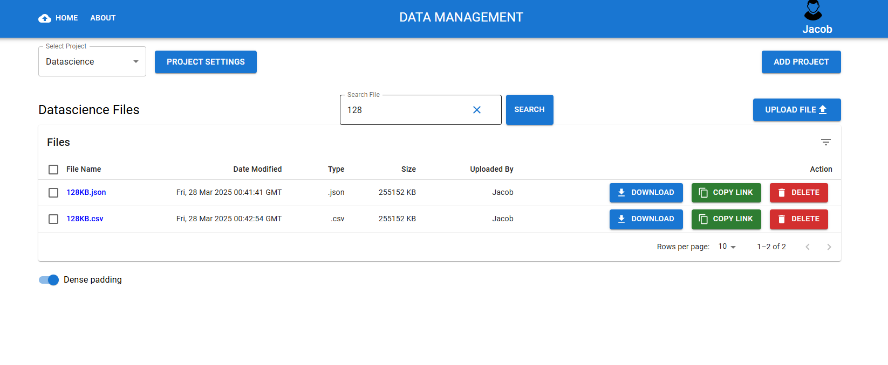
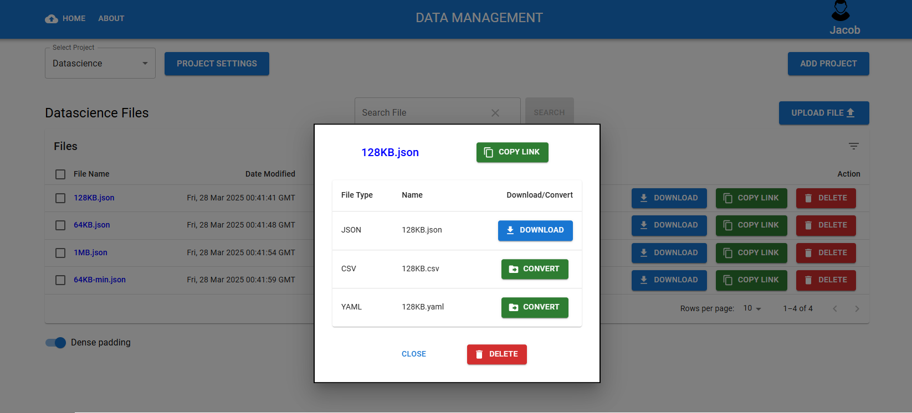
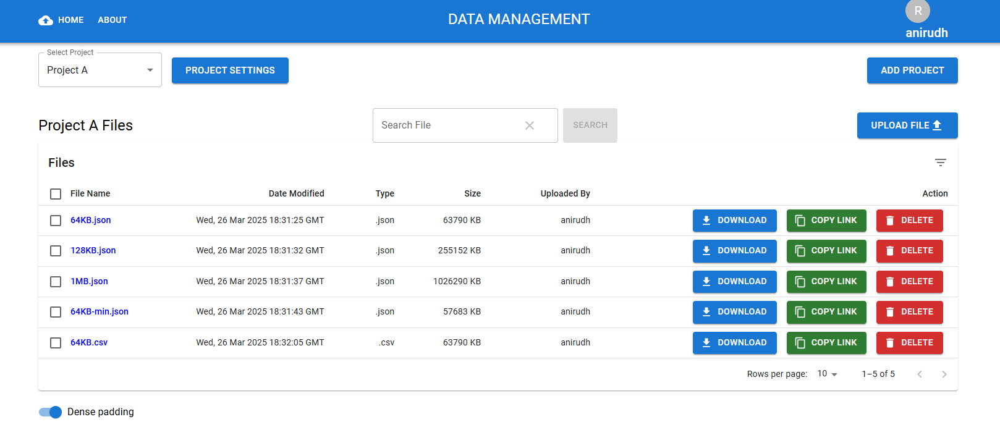

# TeamSync Data Manager

Welcome to **TeamSync Data Manager**, a simple and efficient web application designed to streamline file sharing and data management within your team. Whether you're collaborating on projects, distributing resources, or organizing team assets, TeamSync provides an intuitive platform to keep everything in one place.

## Screenshots




## Features

- **File Upload & Sharing**: Easily upload files and share them with your team members via links or direct access.
- **Organized Storage**: Categorize files into projects for quick retrieval and better organization.
- **Access Control**: Set permissions to control who can view, edit, or download files.
- **Conversion**: Convert files easily between different data formats (json-xml-csv).
- **Real-Time Collaboration**: Team members can access the latest versions of files instantly.
- **Search Functionality**: Quickly find files with a built-in search tool.
- **Cross-Platform**: Access TeamSync from any device with a web browser.

## Getting Started


### Installation
This project requires backend and front end setup seperately. To see how to setup backend go to https://github.com/anirudh9260/teamsync-backend-flask.git
Follow these steps to set up TeamSync Frontend locally:

1. Clone the repository:
```bash
git clone https://github.com/anirudh9260/teamsync-frontend-react.git

```

2. Install dependencies:
```bash
cd teamsync-frontend-react
npm install
```

3. Create a .env file in the root directory:
```bash
REACT_APP_API_URL=http://localhost:5000/dmp-api
```

4. Run the app:
```bash
npm start
```

### Quick Start
1. **Sign In**: Create your new account or use your team-provided username and password .
2. **Upload a File**: Create or Select a project, click the "Upload" button, select your file.
3. **Share**: Generate a shareable link or invite team members directly.
4. **Manage**: Organize files, set permissions, and track usage from the dashboard.

## Usage

### Uploading Files
- Navigate to the Dashboard.
- Click "Upload" and select files from your device.

### Sharing Files
- Click to copy link to copy a shareable link to the file.
- Convert the file on the app before sharing.


### Managing Access
- Go to the "Project" Settings.
- Add or remove team members.
- Assign roles (e.g., Admin, Editor, Viewer) to control access levels.

## Support

If you encounter any issues or have questions:
- Contact your team admin.
- Email our support team at `anirudh.88@live.in`.


## Project Structure
```bash
NewsBite/
├── src/
│   ├── components/    # Reusable UI components
│   ├── hooks/         # Redux hooks
│   ├── pages/         # App page
│   ├── services/      # API calls and business logic
│   ├── redux/         # State management
│   └── assets/        # Images, fonts, etc.
├── images/            # Demo images
└── docs/             # Documentatio
```


## License
This project is licensed under the MIT License - see the  file for details.

## Contact
For any queries, reach out to:
Email: anirudh.88@live.in


**Happy using TeamSync Data Manager!**